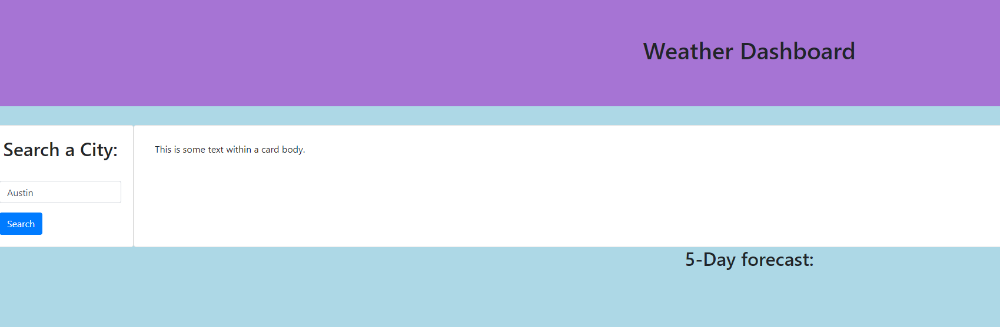

# weather-dashboard

- A simple weather dashboard that displays the current weather for a set location, as well as the 5 day forecast

## Installation

Install my project via git bash

Use "Git Clone git@github.com:Tehseus/weather-dashboard.git" to pull down repository

Link to repository: https://github.com/Tehseus/weather-dashboard

Link to deployed app: https://tehseus.github.io/weather-dashboard/

    
## Screenshots

## Features

- The user is presented with a search box to search the weather for a City.
- When the user inputs a city, the city's current weather is displayed as well as the 5 day forecast.
- When the user inputs a new city, the old city will be saved in local storage and the new city's weather will be displayed.
## License

[MIT](https://choosealicense.com/licenses/mit/)

